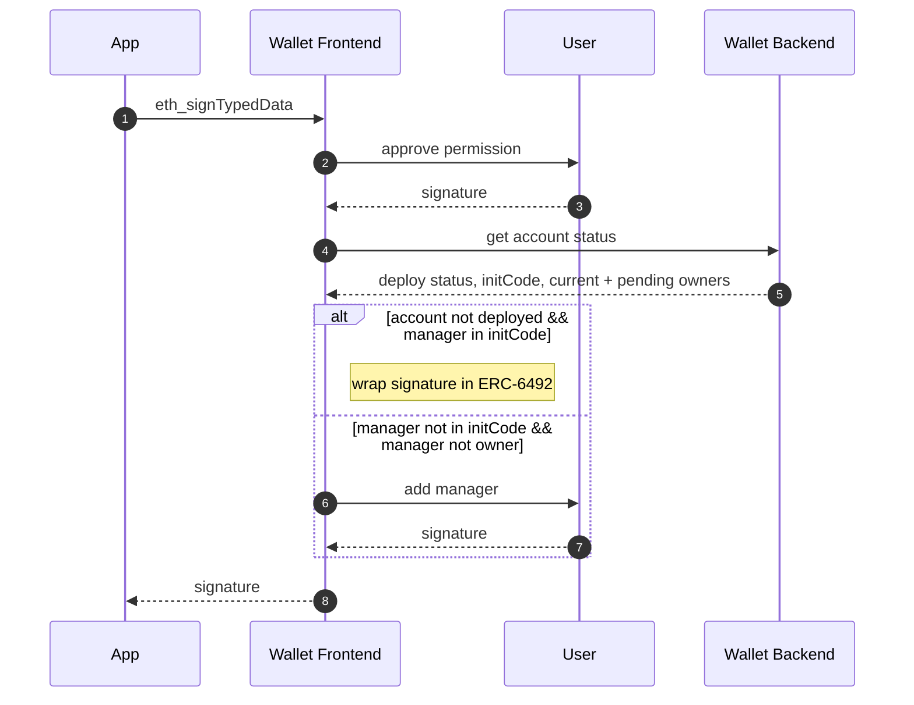
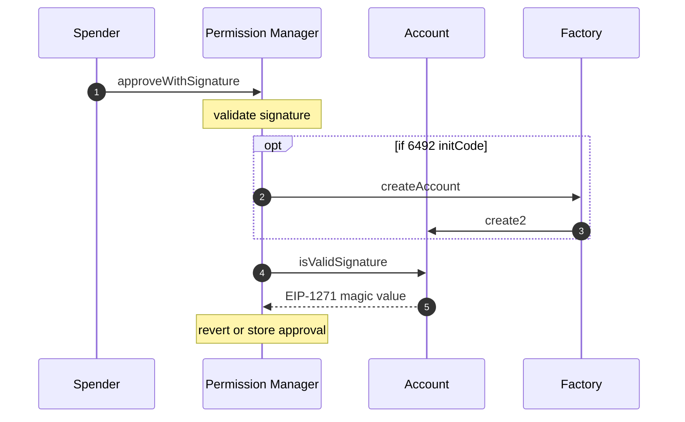
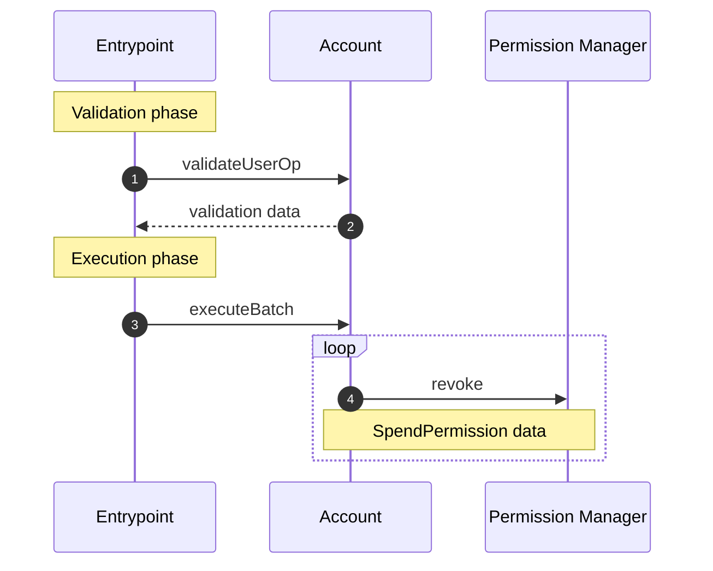

# Spend Permissions

> :information_source: These contracts are unaudited. Please use at your own risk.

**Spend Permissions enable apps to spend native and ERC-20 tokens on behalf of users.**

## Design Overview

### 1. Periphery addition to Coinbase Smart Wallet V1

While implementing this feature as a new V2 wallet implementation was tempting, we decided to leverage the modular owner system from [Smart Wallet V1](https://github.com/coinbase/smart-wallet) and avoid a hard upgrade. This helped reduce our launch timeline and also reduced the risk of introducing this unique account authentication paradigm.

### 2. Only Native and ERC-20 token support

Spend Permissions only support spending Native (e.g. ETH) and ERC-20 (e.g. USDC) tokens with a recurring allowance refresh. This enables use cases like subscriptins (e.g 10 USDC per month) out of the box and also can support apps that want to limit asking users for spend permissions every session.

Compared to an approach that enables apps to make arbitrary external calls from user accounts, we consider this implementation safer given the tighter and fully-known scope of account control.

### 3. Spender-originated calls

Spend Permissions allow users to delegate token spending to a `spender` address, presumably controlled by the app. When an app wants to spend user tokens, it has `spender` call into the user account through a middleware contract, `SpendPermissionManager`, which validates the spend is within the approved allowance.

Compared to an approach that uses the ERC-4337 EntryPoint to prompt external calls from user accounts, we consider this implementation safer given the avoided edge case of accounting for when ERC-4337 Paymasters spend user tokens.

## End-to-end Journey

### 1. App requests permissions from user (offchain)

Apps request spend permissions from users by sending an `eth_signTypedData` request containing the permission details.

### 2. App approves and spends (onchain)

Apps approve their permission by calling `SpendPermissionManager.approveWithSignature` using the signature returned from the wallet when [requesting spend permissions](requestSpendPermission.md).

### 3. User revokes permission (onchain)

Users can revoke permissions at any time by calling `SpendPermissionManager.revoke`, which can also be batched via `CoinbaseSmartWallet.executeBatch`.

