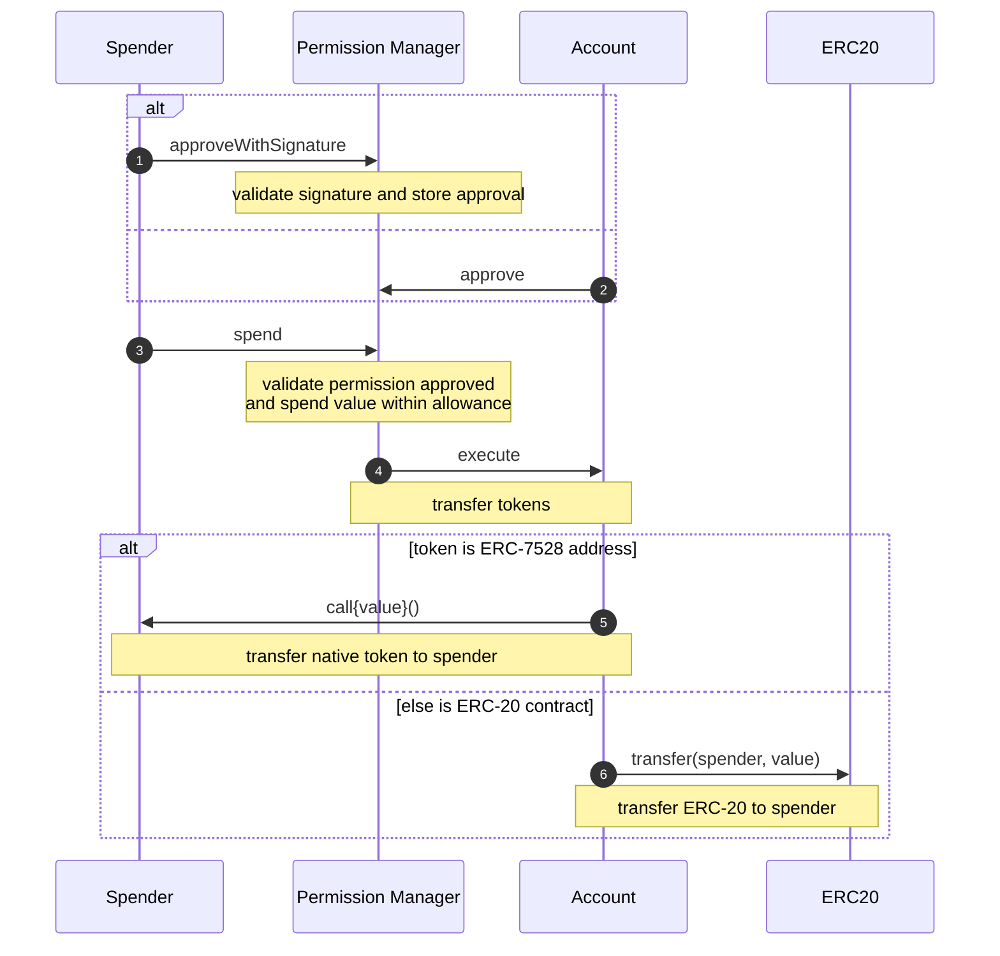

# Spend Permissions

**Spend Permissions enable apps to spend native and ERC-20 tokens on behalf of users.**

## Deployments

The following contracts are deployed on the following chains:

`SpendPermissionManager`: `0xf85210B21cC50302F477BA56686d2019dC9b67Ad`

`PublicERC6492Validator`: `0xcfCE48B757601F3f351CB6f434CB0517aEEE293D`

Testnets:

- Base Sepolia
- Optimism Sepolia
- Ethereum Sepolia

Mainnets:

- Base
- Ethereum
- Optimism
- Arbitrum
- Polygon
- Zora
- Binance Smart Chain
- Avalanche

## Design Overview

### 1. Periphery addition to Coinbase Smart Wallet V1

While implementing this feature as a new V2 wallet implementation was tempting, we decided to leverage the modular owner system from [Smart Wallet V1](https://github.com/coinbase/smart-wallet) and avoid a hard upgrade. The `SpendPermissionManager` singleton is added as an owner of the user's smart wallet, giving it the ability to move user funds on behalf of a sender within the tight constraints of the spend permission logic.

### 2. Only Native and ERC-20 token support

Spend Permissions only supports spending Native (e.g. ETH) and ERC-20 (e.g. USDC) tokens on a recurring period. This enables use cases like subscriptions out of the box (e.g 10 USDC per month) and also can support apps that want to avoid asking users for spend permissions every session.

This approach does **not** enable apps to make arbitrary external calls from user accounts, improving security by having a tighter and fully-known scope of account control.

### 3. Spender-originated calls

Spend Permissions allow users to delegate token spending to a `spender` address, presumably controlled by the app. When an app wants to spend user tokens, it calls into `SpendPermissionManager` from this `spender` address. `SpendPermissionManager` will then validate the spend is within the approved permission's allowance and calls into the user's account to transfer tokens.

This approach does **not** use the ERC-4337 EntryPoint to prompt external calls from user accounts, improving security by avoiding the possibility of ERC-4337 Paymasters spending users' tokens on gas fees.

## End-to-end Journey

### 1. App requests and user signs permissions (offchain)

Apps request spend permissions for users to sign by sending an `eth_signTypedData` RPC request containing the permission details.

Read more details [here](./docs/diagrams/signSpendPermission.md).

### 2. App approves and spends (onchain)

Spenders (apps) spend tokens by calling `SpendPermissionManager.spend` with their spend permission values, a recipient, and an amount of tokens to spend.

Spenders may want to batch this call with an additionally prepended call to [approve their permission via user signature](./approveWithSignature.md) unless the user has already approved the spend permission(s) directly via `SpendPermissionManager.approve`.

Read more details [here](./docs/diagrams/spend.md).

### 3. User revokes permission (onchain)

Users can revoke permissions at any time by calling `SpendPermissionManager.revoke`, which can also be batched via `CoinbaseSmartWallet.executeBatch`.

Read more details [here](./docs/diagrams/revoke.md).

## Security

Audited by [Spearbit](https://spearbit.com/).

| Audit | Date | Report |
|--------|---------|---------|
| First private audit | 10/29/2024 | [Report](audits/Cantina-October-2024.pdf) |
| Public competition || [Report](audits/Cantina-November-2024.pdf) |
| Private audit | 12/10/2024 | [Report](audits/Cantina-December-2024.pdf) |
