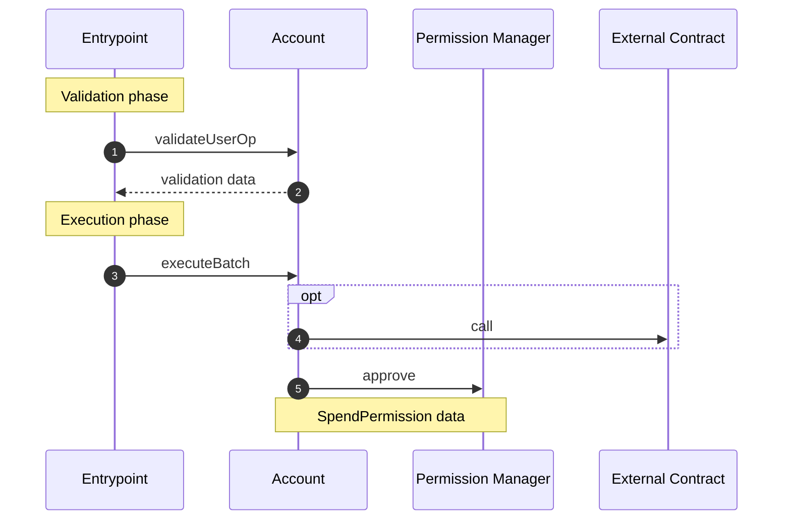

# Approve Permissions

While the default experience is for apps to request the user [sign spend permissions](signSpendPermission.md) and [approve with signatures](./approveWithSignature.md), it can also be valuable to approve permissions via direct calls to `SpendPermissionManager.approve`. For example, paying now to start a subscription and approving a permission to pay the same amount every month.

