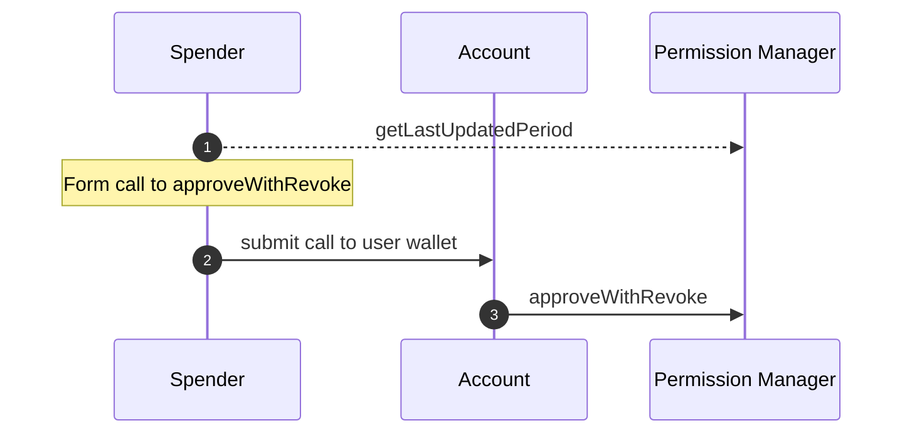

# Atomically Replace a Permission

The approval of some spend permissions may be conditional on the revocation of an existing permission. For example, if a user wants to update their subscription to a higher or lower price tier, they'll need to approve a new spend permission, but will presumably want to revoke the spend permission for their original subscription price. They would not want to enter a state where both the old and new spend
permissions were approved, as a dishonest spender could abuse this privilege and spend more than the user intended.

The function `SpendPermissionManager.approveWithRevoke` can be called directly by the user, passing the old spend permission to revoke,
the new permission to approve, and an instance of a `PeriodSpend` struct, representing the last updated period
spend against the old spend permission. When the call to `approveWithRevoke` is made, the call will revert if there has been any additional spending activity against the old spend permission since the value passed as `lastValidUpdatedPeriod` was calculated via `SpendPermissionManager.getLastUpdatedPeriod`. This is intended to prevent the spender from frontrunning a call to `approveWithRevoke`
that would use the remaining allowance in the current period just before the permission is revoked. Note that this mechanism (and no mechanism) can prevent a spender from frontrunning to use the entirety of their allowance in an active period, but it will prevent the
approval of the new spend permission in the case that a spender abuses a user's trust in this way.

Note that an old spend permission and the new spend permission need only share the `account` property. All other properties can be
different between the two permissions, and no cumulative spend state is carried over from one permission to the next.

