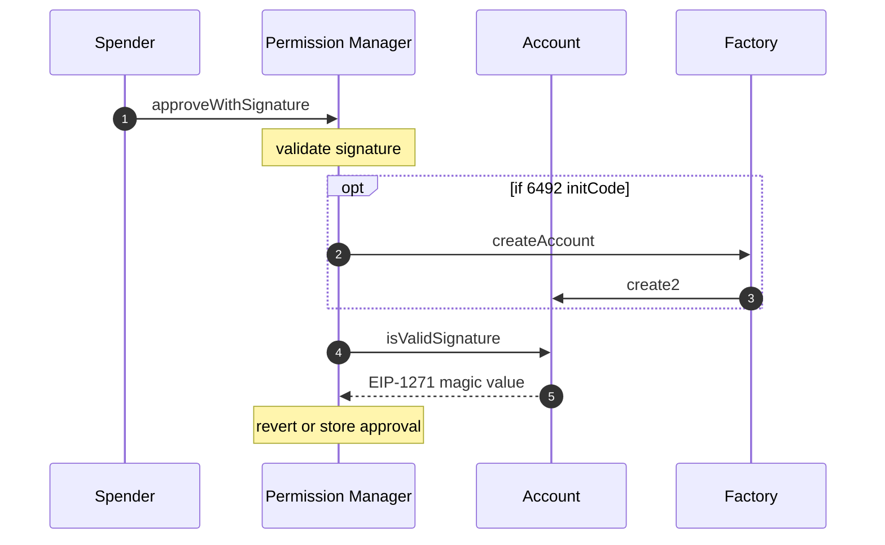

# Approve Permission With Signature

Apps approve their permission by calling `SpendPermissionManager.approveWithSignature` using the signature returned from the wallet when [signing spend permissions](signSpendPermission.md).

If the signature is [ERC-6492](https://eips.ethereum.org/EIPS/eip-6492) formatted, `SpendPermissionManager` will automatically detect this and deploy the account on behalf of the app. Afterwards, it will call `isValidSignature` to verify the account signed the permission.

