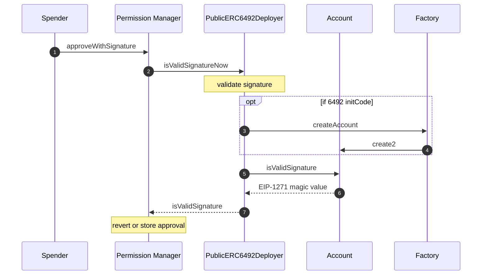

# Approve Permission With Signature

Apps approve their permission by calling `SpendPermissionManager.approveWithSignature` using the signature returned from the wallet when [signing spend permissions](signSpendPermission.md). Note that there is also a batch version of this function, `SpendPermissionManager.approveBatchWithSignature` that works in the same way but allows a batch of spend permissions to be signed at once.

If the user account is not yet deployed, the signature should be [ERC-6492](https://eips.ethereum.org/EIPS/eip-6492) formatted. The `SpendPermissionManager` delegates signature validation to a separate contract, `PublicERC6492Validator`, which will automatically detect this and deploy the account on behalf of the app. Afterwards, it will call `isValidSignature` to verify the account signed the permission and return this outcome to the `SpendPermissionManager`.

Delegation of signature validation to a separate contract is necessary when supporting ERC-6492 signatures. The `SpendPermissionManager` contract is an owner of the user's smart contract wallet and therefore extremely privileged. ERC-6492 signature formats allow the introduction of an arbitrary target and calldata that is blindly executed by the 6492 implementer. If this implementer is the `SpendPermissionManger` it can make arbitrary calls to the user's smart contract wallet as an owner. Delegating signature validation to a dedicated contract that has no privilege prevents this vulnerability.

