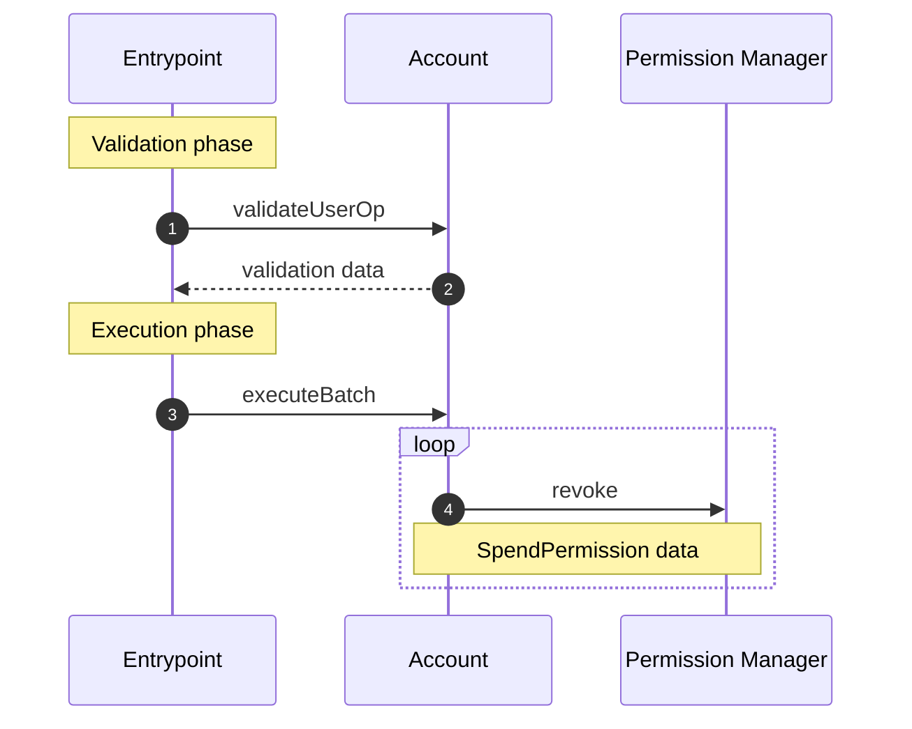

# Revoke Permissions

Users can revoke permissions at any time by calling `SpendPermissionManager.revoke`, which can also be batched via `CoinbaseSmartWallet.executeBatch`.

```mermaid
sequenceDiagram
    autonumber
    participant E as Entrypoint
    participant A as Account
    participant PM as Permission Manager

    Note over E: Validation phase
    E->>A: validateUserOp
    A-->>E: validation data
    Note over E: Execution phase
    E->>A: executeBatch
    loop
        A->>PM: revoke
        Note over A,PM: SpendPermission data
    end
```
