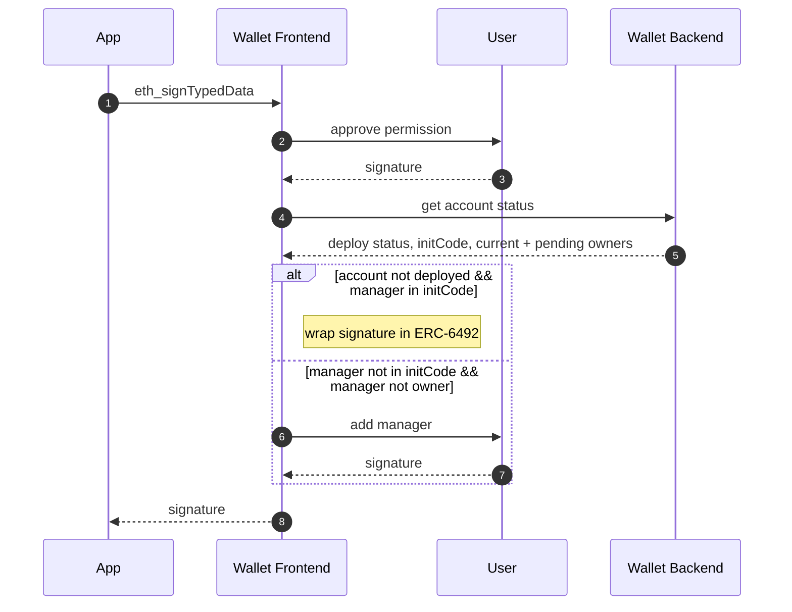

# Sign Spend Permission

Apps request spend permissions from users by sending an `eth_signTypedData` request containing the permission details.

Users are guided to sign the permission hash (or the hash of a batch of spend permissions) and add the `SpendPermissionManager` contract as an owner if it is not already. Signing to approve enables users to not spend gas on this action, offloading this cost to the app.

If a users account is not yet deployed, but has the `SpendPermissionManager` as an initial owner in its `initCode`, the returned signature is formatted according to [ERC-6492](https://eips.ethereum.org/EIPS/eip-6492) with the `CoinbaseSmartWalletFactory` address and this `initCode`.

This entire process takes place offchain and requires no transactions or network fees.

