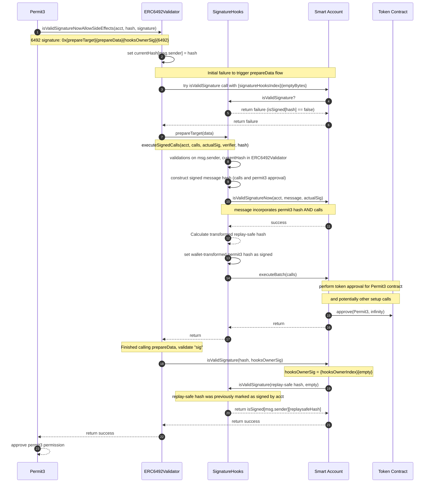

# Example signed calls sequence 

```mermaid
sequenceDiagram
    autonumber
    participant P as Permit3
    participant V as ERC6492Validator
    participant H as SignatureHooks
    participant A as Smart Account
    participant T as Token Contract

    P->>V: isValidSignatureNowAllowSideEffects(acct, hash, signature)
    Note over P,V: 6492 signature: 0x{prepareTarget}{prepareData}{hooksOwnerSig}{6492}
    V->>V: set currentHash[msg.sender] = hash
    Note over V,A: Initial failure to trigger prepareData flow
    V->>A: try isValidSignature call with {signatureHooksIndex}{emptyBytes}
    A->>H: isValidSignature?
    H-->>A: return failure (isSigned[hash] == false)
    A-->>V: return failure
    V->> H: prepareTarget(data)
    Note over V,H: executeSignedCalls(acct, calls, actualSig, verifier, hash)
    H->>H: validations on msg.sender, currentHash in ERC6492Validator
    H->>H: construct signed message hash (calls and permit3 approval)
    H->>A: isValidSignatureNow(acct, message, actualSig)
    Note over H,A: message incorporates permit3 hash AND calls
    A-->>H: success
    H-->>H: Calculate transformed replay-safe hash
    H->>H: set wallet-transformed permit3 hash as signed
    H->>A: executeBatch(calls)
    Note over A,T: perform token approval for Permit3 contract
    Note over A,T: and potentially other setup calls
    A->>T: approve(Permit3, infinity)
    A-->>H: return
    H-->>V: return
    Note over V: Finished calling prepareData, validate "sig"
    V->>A: isValidSignature(hash, hooksOwnerSig)
    Note over A: hooksOwnerSig = {hooksOwnerIndex}{empty}
    A->>H: isValidSignature(replay-safe hash, empty)
    Note over H: replay-safe hash was previously marked as signed by acct
    H-->>A: return isSigned[msg.sender][replaysafeHash]
    A-->>V: return success
    V-->>P: return success
    P-->>P: approve permit3 permission
```
