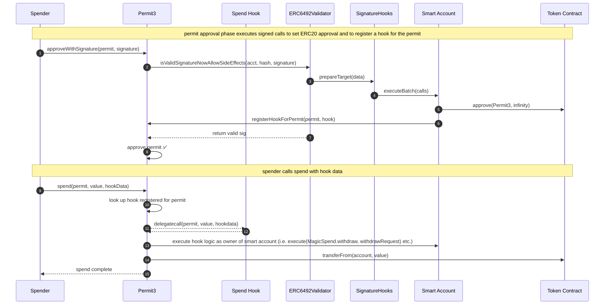

# Example spend with delegated hook sequence 

```mermaid
sequenceDiagram
    autonumber
    participant S as Spender
    participant P as Permit3
    participant SH as Spend Hook
    participant V as ERC6492Validator
    participant H as SignatureHooks
    participant A as Smart Account
    participant T as Token Contract

    Note over S,T: permit approval phase executes signed calls to set ERC20 approval and to register a hook for the permit
    S->>P: approveWithSignature(permit, signature)
    P->>V: isValidSignatureNowAllowSideEffects(acct, hash, signature)
    V->> H: prepareTarget(data)
    H->>A: executeBatch(calls)
    A->>T: approve(Permit3, infinity)
    A->>P: registerHookForPermit(permit, hook)
    V-->>P: return valid sig
    P->>P: approve permit ✅
    Note over S,T: spender calls spend with hook data
    S->>P: spend(permit, value, hookData)
    P->>P: look up hook registered for permit
    P-->>SH: delegatecall(permit, value, hookdata)
    SH-->>P: 
    P->>A: execute hook logic as owner of smart account (i.e. execute(MagicSpend.withdraw, withdrawRequest) etc.)
    P->>T: transferFrom(account, value)
    P-->>S: spend complete
```