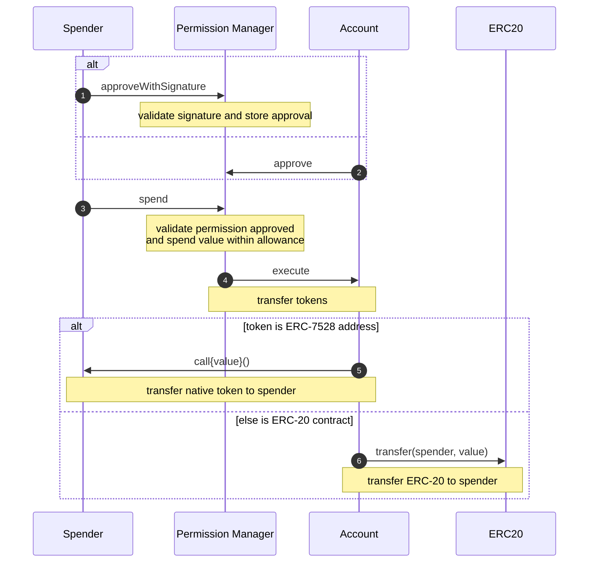

# Spend Tokens

Spenders (apps) spend tokens by calling `SpendPermissionManager.spend` with their spend permission values, a recipient, and an amount of tokens to spend.

Spenders may want to batch this call with an additionally prepended call to [approve their permission via user signature](./approveWithSignature.md) or the convenience function `SpendPermissionManager.spendWithSignature`. After a permission is approved, it is cheaper to avoid re-validating the signature and approval by just calling `SpendPermissionManager.spend` for repeated use.

When executing a spend, `SpendPermissionManager` calls `CoinbaseSmartWallet.execute` with either a call to transfer native or ERC-20 tokens to the recipient. Only these two kinds of calls are allowed by the `SpendPermissionManager` on a `CoinbaseSmartWallet` for reduced risk.

